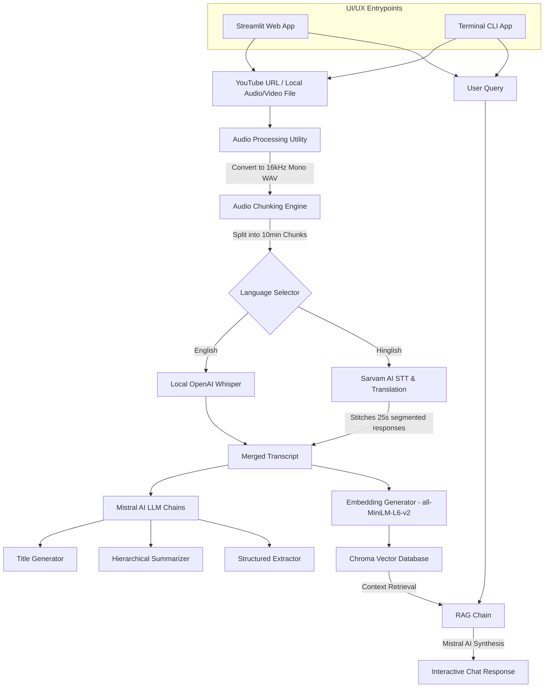

# 🎬 GenAI Meeting Intelligence & RAG Assistant

[](https://www.python.org/)
[](https://streamlit.io/)
[](https://www.langchain.com/)
[](https://www.trychroma.com/)
[](https://www.sarvam.ai/)

An advanced, multi-modal AI Meeting Intelligence system that turns any video or audio source into a structured knowledge base. It ingests local audio/video files or YouTube links, performs localized Speech-to-Text (STT) transcription, applies state-of-the-art Natural Language Processing to extract action items, decisions, and open questions, and exposes an interactive retrieval-augmented generation (RAG) chat system.

---

## 🔍 Table of Contents
- [Core Features](#-core-features)
- [System Architecture](#-system-architecture)
- [Technology Stack](#-technology-stack)
- [Project Directory Structure](#-project-directory-structure)
- [Prerequisites & System Dependencies](#-prerequisites--system-dependencies)
- [Installation & Setup](#-installation--setup)
- [Configuration (.env)](#-configuration-env)
- [Usage Instructions](#-usage-instructions)
  - [Streamlit Web Application (GUI)](#streamlit-web-application-gui)
  - [Command Line Interface (CLI)](#command-line-interface-cli)
  - [Testing Pipeline](#testing-pipeline)
- [Deep Dive: Processing Mechanics](#-deep-dive-processing-mechanics)
  - [Smart Audio Transcription Routing](#1-smart-audio-transcription-routing)
  - [RAG Search Pipeline](#2-rag-search-pipeline)

---

## ⚡ Core Features

* **Multi-Format Ingestion**: Download audio directly from YouTube URLs (`yt-dlp`) or process local audio and video files (converts MP4, MP3, etc. to 16kHz mono WAV using `pydub`/`FFmpeg`).
* **Bilingual Transcription**:
  * **English**: Local transcription using OpenAI's Whisper model (runs completely on your device).
  * **Hinglish/Hindi**: API-based transcription and automatic translation to English using Sarvam AI’s advanced language models.
* **Intelligent Synthesis**:
  * Auto-generates concise, professional meeting titles.
  * Produces hierarchical, bulleted meeting summaries.
  * Structured extraction of **Action Items** (with owner & deadline tracking), **Key Decisions**, and **Open/Unresolved Questions**.
* **Chat with your Meeting (RAG)**: Chatbot powered by ChromaDB and Sentence-Transformers, enabling you to query the meeting transcript for specific details using natural language.
* **Premium Dark Mode GUI**: Sleek, animated dashboard built with Streamlit featuring visual pipelines, step-by-step progress tracking, custom cards, and persistent chat sessions.

---

## 🏗️ System Architecture



---

## 🛠️ Technology Stack

| Component | Technology | Purpose |
| :--- | :--- | :--- |
| **Frontend UI** | [Streamlit](https://streamlit.io/) + Custom CSS | Futuristic Dark Mode dashboard interface |
| **Ingestion** | [yt-dlp](https://github.com/yt-dlp/yt-dlp) & [pydub](http://pydub.com/) | Media downloads and format normalizations |
| **Local STT** | [OpenAI Whisper](https://github.com/openai/whisper) + [PyTorch](https://pytorch.org/) | On-premise offline English transcription |
| **Cloud STT** | [Sarvam AI API](https://www.sarvam.ai/) | Hindi / Hinglish translation & audio transcription |
| **Orchestration**| [LangChain (LCEL)](https://www.langchain.com/) | Prompt routing, context parsing, and chain linkages |
| **LLM Model** | [Mistral AI API](https://mistral.ai/) (`mistral-small-latest`) | High-reasoning summarization, extraction, and QA |
| **Vector DB** | [ChromaDB](https://www.trychroma.com/) | Persistent document storage and similarity retrieval |
| **Embeddings** | [Sentence-Transformers](https://huggingface.co/sentence-transformers/all-MiniLM-L6-v2) | Local semantic vector generation (`all-MiniLM-L6-v2`) |

---

## 📂 Project Directory Structure

```text
├── core/
│   ├── extractor.py       # LLM chains extracting Action Items, Decisions, & Questions
│   ├── rag_engine.py      # Core RAG pipeline builder and query executor
│   ├── summarizer.py      # Map-Reduce transcript summarizer & title generator
│   ├── transcriber.py     # Local Whisper & Sarvam translation router
│   └── vector_store.py    # Chroma DB initialization, document chunking & embeddings
├── utils/
│   └── audio_processor.py # Downloader, format converter, and segmenter
├── app.py                 # Streamlit graphical application frontend
├── main.py                # Command Line pipeline runner & console chat interface
├── test.py                # Mock script for pipeline regression testing
├── Requirements.txt       # Python environment dependencies
└── .gitignore             # Standard git exclusions
```

---

## 📋 Prerequisites & System Dependencies

### FFmpeg Installation
This project requires **FFmpeg** to extract, convert, and chunk audio streams. It must be installed on your host system:

* **macOS**: `brew install ffmpeg`
* **Linux (Ubuntu/Debian)**: `sudo apt update && sudo apt install ffmpeg`
* **Windows**: Download the binary build from the [FFmpeg website](https://ffmpeg.org/download.html), extract it, and add its `bin/` directory path to your system's Environment Variables (`PATH`).

---

## ⚙️ Installation & Setup

1. **Clone the Repository**:
   ```bash
   git clone https://github.com/SuprabhSharma/GenAI-assistant.git
   cd GenAI-assistant
   ```

2. **Create a Virtual Environment**:
   ```bash
   # Windows PowerShell
   python -m venv venv
   .\venv\Scripts\Activate.ps1

   # macOS/Linux
   python3 -m venv venv
   source venv/bin/activate
   ```

3. **Install Dependencies**:
   ```bash
   pip install -r Requirements.txt
   ```

---

## 🔑 Configuration (.env)

Create a `.env` file in the root folder of the project. Include your API credentials and preferred configuration parameters:

```env
# Mistral AI configuration (Required for Summarization, Extraction, and RAG)
MISTRAL_API_KEY=your_mistral_api_key_here

# Sarvam AI configuration (Required ONLY if using Hinglish/Hindi transcription)
SARVAM_API_KEY=your_sarvam_api_key_here
SARVAM_STT_MODEL=saaras:v2.5

# Whisper Local Model Selection (Options: tiny, base, small, medium, large)
WHISPER_MODEL=small
```

---

## 🚀 Usage Instructions

### Streamlit Web Application (GUI)
Start the modern reactive dashboard in your browser:
```bash
streamlit run app.py
```
* Once loaded, paste a YouTube link or input a local video/audio file path in the sidebar.
* Choose your transcript language (English or Hinglish).
* Press **Analyse** to watch the pipeline execute in real-time.
* View results and use the **Interactive Chat** box at the bottom to query the transcript.

### Command Line Interface (CLI)
Run the pipeline entirely in the terminal:
```bash
python main.py
```
* Provide the source URL or local path.
* Set the language.
* Review the formatted summary, actions, and decisions.
* Type your questions to query the context in a continuous terminal loop.

### Testing Pipeline
Run the mock verification script to validate Whisper and Mistral configurations:
```bash
python test.py
```

---

## 🧠 Deep Dive: Processing Mechanics

### 1. Smart Audio Transcription Routing
The transcriber ([core/transcriber.py](file:///C:/Users/hp/.gemini/antigravity/scratch/GenAI-assistant/core/transcriber.py)) uses context-aware routing:
* **Whisper local engine**: Loaded statically via PyTorch. Standardized audio segments are passed directly to extract texts locally.
* **Sarvam API engine**: Sarvam's synchronous translator is optimized for segments $\le$ 30 seconds. To support long audio streams:
  1. The transcriber segments the audio file into 25-second windows (using a 5-second buffer limit).
  2. Each segment is sent concurrently/sequentially to Sarvam.
  3. The resulting translated texts are concatenated automatically to construct the final transcript.

### 2. RAG Search Pipeline
Using ChromaDB:
* Text transcripts are split into **500-character chunks** with **50-character overlaps** using LangChain's `RecursiveCharacterTextSplitter`.
* Chunks are encoded into 384-dimensional space using HuggingFace's `all-MiniLM-L6-v2` embedding model.
* The RAG chain loads the relevant indices. During chat interaction, it queries the top $k=4$ contexts matching the semantic intent, passing them as constraints in the prompt instructions to Mistral AI.
